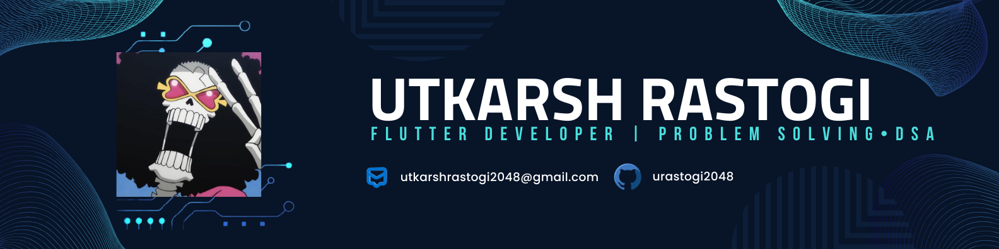

  

<h2 align="center">
  
</h2>
<h1 align="center">Flutter Developer • Problem Solving & DSA</h1>

🎓 2nd-year CSE student at <b>IIIT Bhagalpur</b>  
📱 Building real-world applications using <b>Flutter & NodeJs</b> 
🧠 Interested in <b>Data Structures, Algorithms & Competitive Programming</b>  
🌱 Experience in <b>open-source contributions and collaborative projects</b> 

---

<h2 align="center">🧰 Tech Stack</h2>

  

  <i>Flutter-centric development with strong programming fundamentals and backend exposure.</i>

---

---
---

---

<h2 align="center">🚀 Top Languages </h2>

  

<h2 align="center">Connect with me</h2>

  
  &nbsp;
  

