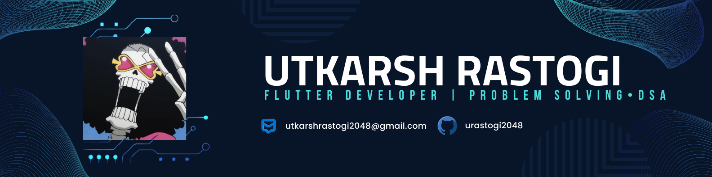

<p align="center">
  
</p>

<h2 align="center">
  
</h2>

<p align="center">
  <b>Software Engineering • Full-Stack • Mobile • Systems • DSA</b>
</p>

<p align="center">
  <a href="mailto:utkarshrastogi2048@gmail.com">
    
  </a>
  <a href="https://www.linkedin.com/in/utkarsh-rastogi-8b1bb0317/">
    
  </a>
  <a href="https://github.com/urastogi2048">
    
  </a>
</p>

<p align="center">
  
</p>

---

## 👨‍💻 About Me

```cpp
class Utkarsh {

    string role = "Software Engineer";
    string education = "B.Tech CSE @ IIIT Bhagalpur";

    vector<string> interests = {
        "Software Engineering",
        "Backend & Distributed Systems",
        "Mobile Development",
        "Data Structures & Algorithms"
    };

    vector<string> currently_learning = {
        "System Design",
        "Kafka",
        "Redis",
        "Docker",
        "Cloud Infrastructure"
    };

    string philosophy =
        "Understand the fundamentals. Build. Ship. Improve.";
};
```

* 🎓 **B.Tech CSE @ IIIT Bhagalpur** — **8.60/10 CGPA**
* 💻 Building production-oriented applications across **mobile, backend and cloud**
* 📱 Strong experience with **Flutter & Dart**
* ⚙️ Backend development with **Node.js, Express.js, Firebase & REST APIs**
* ☁️ Exploring **AWS, Docker, Redis, Kafka & distributed systems**
* 🧠 Competitive programming enthusiast focused on **DSA & problem solving**
* 🌱 Active in **open source & hackathons**
* 🚀 Open to **SDE / Software Engineering internships**

---

## 🛠️ Tech Stack

### Languages

<p>
  
</p>

`C++` `C` `Dart` `JavaScript` `Python` `SQL` `NoSQL`

### Development

<p>
  
</p>

`Flutter` `Node.js` `Express.js` `Firebase` `Firestore` `REST APIs` `Socket.io`

### Infrastructure & Systems

<p>
  
</p>

`AWS EC2/S3` `Docker` `Redis` `Kafka` `Linux` `WSL`

### Engineering

`DSA` `Competitive Programming` `System Design` `API Design`
`Caching` `Authentication` `Offline-first Architecture`
`MVC` `State Management` `Full-Stack Development`

### Tools

<p>
  
</p>

---

## 🧠 What I Like Building

```text
                    SOFTWARE ENGINEERING
                           │
          ┌────────────────┼────────────────┐
          │                │                │
       FRONTEND          BACKEND          SYSTEMS
          │                │                │
       Flutter          Node.js           Redis
       Dart             Express           Kafka
       Firebase         REST APIs         Docker
          │                │                │
          └────────────────┼────────────────┘
                           │
                     CLOUD & SCALE
                           │
                      AWS / Linux
                           │
                    System Design
```

I enjoy working on problems involving:

* ⚡ Performance and optimization
* 🔄 Real-time communication
* 💾 Caching and data persistence
* 🔐 Authentication and authorization
* 📡 API design
* 📱 Offline-first applications
* ☁️ Cloud deployment
* 🧩 Scalable backend architecture

---

## 🏆 Competitive Programming

<p align="center">
  
</p>

<p align="center">

  

  

  

  

</p>

### 🥇 Highlights

* 🏆 **FOSS HACK 2026 — Winner**
* 🥈 **BitBYBit National Hackathon — Runner-up**
* 🥉 **Smart India Hackathon — Top 3 Institute Selection**
* 🌐 **OPcode Open Source Competition — Top 16 / 1,000+**
* 🥉 **Syntax Sprint — 3rd Prize**

---

## 📊 GitHub Analytics

<p align="center">
  


</p>

<p align="center">
  
</p>

---

## 📈 Contribution Activity

<p align="center">
  
</p>

---

## 🐍 Contribution Snake

<p align="center">
  
</p>

---

## 🚀 Currently Exploring

```text
Distributed Systems
        ↓
   ┌────┴────┐
   ↓         ↓
 Kafka      Redis
   ↓         ↓
Event      Caching
Streaming   & Performance
   └────┬────┘
        ↓
    System Design
        ↓
Cloud & Scalable Backend Systems
```

Currently going deeper into:

* 🔥 **Kafka & event-driven architecture**
* ⚡ **Redis & caching strategies**
* 🐳 **Docker & containerized applications**
* ☁️ **AWS & cloud infrastructure**
* 🏗️ **System Design**
* 🗄️ **PostgreSQL & database architecture**

---

## 🎯 2026 Goals

* [x] Ship production applications
* [x] Contribute to open source
* [x] Participate in hackathons
* [x] Build real-world backend systems
* [ ] Become stronger at system design
* [ ] Contribute to larger open-source projects
* [ ] Deepen distributed systems knowledge
* [ ] Land a strong **Software Engineering Internship**

---

## ⚡ Quick Facts

|                    |                           |
| ------------------ | ------------------------- |
| 🎓 Education       | IIIT Bhagalpur — CSE      |
| 📱 Primary Stack   | Flutter + Node.js         |
| 💻 Problem Solving | C++ / DSA                 |
| ☁️ Cloud           | AWS                       |
| 🗄️ Databases      | MongoDB / Firestore / SQL |
| ⚡ Systems          | Redis / Kafka / Docker    |
| 🏆 Hackathons      | Winner + Runner-up        |
| 🧠 LeetCode        | 350+ Problems             |
| 🌱 Focus           | Software Engineering      |

---

## 💬 Developer Philosophy

> **"Don't just make it work. Understand why it works, then make it better."**

---

## 🤝 Let's Connect

<p align="center">
  <a href="mailto:utkarshrastogi2048@gmail.com">
    
  </a>

  <a href="https://www.linkedin.com/in/utkarsh-rastogi-8b1bb0317/">
    
  </a>
</p>

<p align="center">
  
</p>

<p align="center">
  <i>Build systems. Solve problems. Ship software.</i>
</p>
